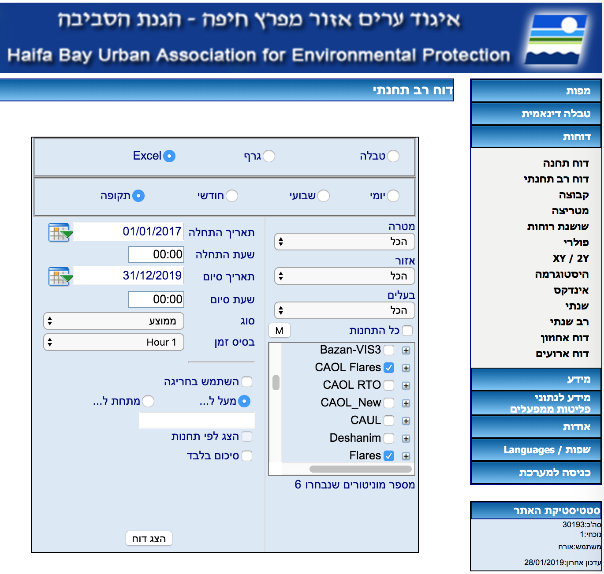

# Data Collection

Input data can be obtained from "איגוד ערים"'s website:
- Go to http://www.envihaifa.net/
- Click "דוחות"
- Click "דוח רב תחנתי"
- Fill the form according to the following screenshot:

- Click "הצג דוח"
- Save the file, e.g. 'Data/Flares.xls.html'
  (note you should add .html as an extension, due to the un-orthodox way the site exports Excel files)
